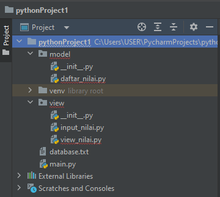
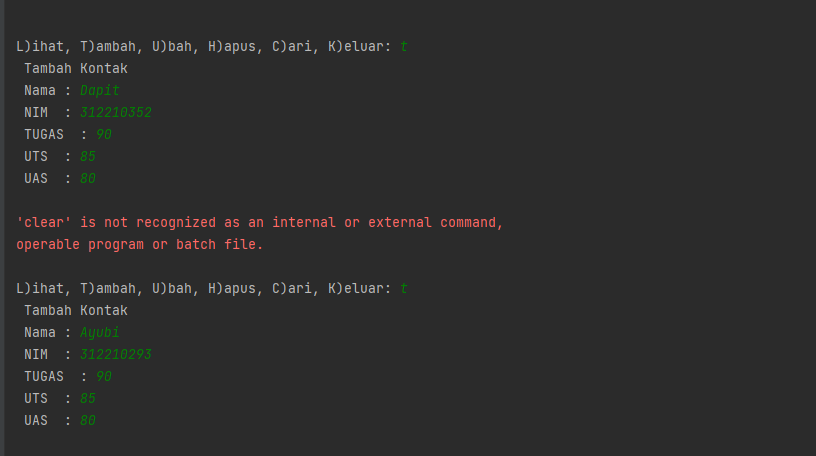
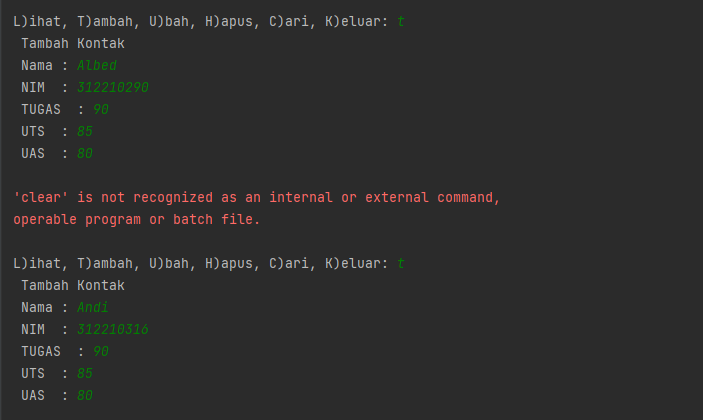
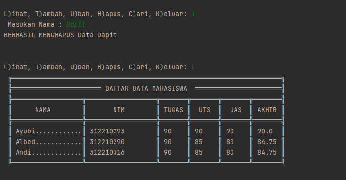
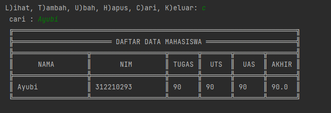
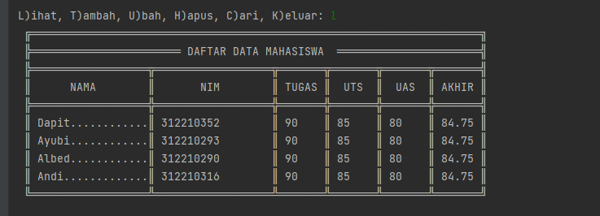
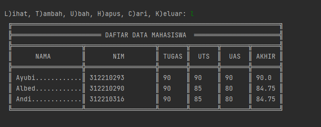
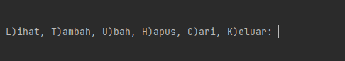

# UAS
# NAMA : MUHAMMAD DIN AL AYUBI
# NIM : 312210293
# KELAS : TI 22 A3
# PACKAGE & MODULE
**Tugas ini berdasarkan praktikum sebelumnya dengan struktur seperti ini:**

* ``daftar_nilai.py`` berisi modul untuk :
    * tambah_data
```python
    elif c.lower() == 't':
i = open('view/database.txt', 'a')
P(" Tambah Kontak")
while (True):
    nama = input(" Nama : ")
    if nama == '':
        P(' Masukan dengan Nama Dengan Benar')
    else:
        break
while (True):
    try:
        nim = int(input(" NIM  : "))
        if nim == '':
            P(' Masukan Nim dengan Angka')
    except ValueError:
        P(' Masukan Nim dengan Angka')
    else:
        break
while (True):
    try:
        tugas = int(input(" TUGAS  : "))
        if tugas == '':
            P(' Masukan TUGAS dengan Angka')
    except ValueError:
        P(' Masukan TUGAS dengan Angka')
    else:
        break
while (True):
    try:
        uts = int(input(" UTS  : "))
        if uts == '':
            P(' Masukan UTS dengan Angka')
    except ValueError:
        P(' Masukan UTS dengan Angka')
    else:
        break
while (True):
    try:
        uas = int(input(" UAS  : "))
        if uas == '':
            P(' Masukan UAS dengan Angka')
    except ValueError:
        P(' Masukan UAS dengan Angka')
    else:
        break
akhir = round((float(tugas) * 0.3) + (float(uts) * 0.35) + (float(uas) * 0.35), 2)
i.write('\nNama : ' + nama + '|Nim : ' + str(nim) + '|Tugas : ' + str(tugas) + '|UTS : ' + str(uts) + '|UAS : ' + str(
    uas) + "|Akhir : " + str(akhir) + '\n')
i.close()
Oc("clear")
```
* **Output tambah_data**


    * ubah_data
```python
elif c.lower() == 'u':
u = open('view/database.txt', 'r').read().splitlines()
target = input(' Masukan Nama : ')
nm = []
for l in u:
    if l == '':
        pass
    else:
        l1 = l.replace('Nama : ', '').replace('Nim : ', '').replace('Tugas : ', '').replace('UTS : ', '').replace(
            'UAS : ', '').replace('Akhir : ', '')
        na, ni, tu, uts, uas, akhir = l1.strip().split('|')
        if na == target:
            P(' Mengedit Data %s' % (target))
            while (True):
                nama = input(" Nama : ")
                if nama == '':
                    P(' Masukan dengan Nama Dengan Benar')
                else:
                    break
            while (True):
                try:
                    nim = int(input(" NIM  : "))
                    if nim == '':
                        P(' Masukan Nim dengan Angka')
                except ValueError:
                    P(' Masukan Nim dengan Angka')
                else:
                    break
            while (True):
                try:
                    tugas = int(input(" TUGAS  : "))
                    if tugas == '':
                        P(' Masukan TUGAS dengan Angka')
                except ValueError:
                    P(' Masukan TUGAS dengan Angka')
                else:
                    break
            while (True):
                try:
                    uts = int(input(" UTS  : "))
                    if uts == '':
                        P(' Masukan UTS dengan Angka')
                except ValueError:
                    P(' Masukan UTS dengan Angka')
                else:
                    break
            while (True):
                try:
                    uas = int(input(" UAS  : "))
                    if uas == '':
                        P(' Masukan UAS dengan Angka')
                except ValueError:
                    P(' Masukan UAS dengan Angka')
                else:
                    break
            akhir = round((float(tugas) * 0.3) + (float(uts) * 0.35) + (float(uas) * 0.35), 2)
            edit = ('Nama : ' + nama + '|Nim : ' + str(nim) + '|Tugas : ' + str(tugas) + '|UTS : ' + str(
                uts) + '|UAS : ' + str(uas) + "|Akhir : " + str(akhir) + '\n')
            nm.append(edit + '\n')
        else:
            nm.append(str(l) + '\n')
new = open('view/database.txt', 'w')
new.write(str(nm))
new.close()
new = open('view/database.txt', 'r').read().splitlines()
new1 = open('view/database.txt', 'w')
new1.close()
new2 = open('view/database.txt', 'a')
for i in new:
    i2 = i.replace("['", "").replace("\\n', '", "\n").replace("']", "").replace("\\n", "\n")
    new2.write(i2 + '\n')
new2.close()
```
* ***Output ubah_data**

    * hapus_data
```python
elif c.lower() == 'h':
u = open('view/database.txt', 'r').read().splitlines()
target = input(' Masukan Nama : ')
nm = []
for l in u:
    if l == '':
        pass
    else:
        l1 = l.replace('Nama : ', '').replace('Nim : ', '').replace('Tugas : ', '').replace('UTS : ', '').replace(
            'UAS : ', '').replace('Akhir : ', '')
        na, ni, tu, uts, uas, akhir = l1.strip().split('|')
        if str(na) == str(target):
            P('BERHASIL MENGHAPUS Data %s' % (target))
            pass
        else:
            nm.append(str(l) + '\n')
new = open('view/database.txt', 'w')
new.write(str(nm))
new.close()
new = open('view/database.txt', 'r').read().splitlines()
new1 = open('view/database.txt', 'w')
new1.close()
new2 = open('view/database.txt', 'a')
for i in new:
    i2 = i.replace("['", "").replace("\\n', '", "\n").replace("']", "").replace("\\n", '')
    new2.write(i2)
new2.close()
```
* ***Output hapus_data***

    * cari_data
```python
elif c.lower() == 'c':
cari = input(' cari : ')
i = open('view/database.txt', 'r').read().splitlines()
P(" ╔═════════════════════════════════════════════════════════════════════╗")
P(" ╠════════════════════════ DAFTAR DATA MAHASISWA ══════════════════════╣")
P(" ╠══════════════════╦══════════════════╦═══════╦═══════╦═══════╦═══════╣")
P(" ║      NAMA        ║       NIM        ║ TUGAS ║  UTS  ║  UAS  ║ AKHIR ║")
P(" ╠══════════════════╬══════════════════╬═══════╬═══════╬═══════╬═══════╣")
for l in i:
    if l == '':
        pass
    elif cari in l:
        l1 = l.replace('Nama : ', '').replace('Nim : ', '').replace('Tugas : ', '').replace('UTS : ', '').replace(
            'UAS : ', '').replace('Akhir : ', '')
        na, ni, tu, uts, uas, akhir = l1.strip().split('|')
        P((' ║ ') + (na).ljust(17) + ('║ ') + (ni).ljust(17) + ('║ ') + (tu).ljust(6) + ('║ ') + (uts).ljust(6) + (
            '║ ') + (uas).ljust(6) + ('║ ') + (akhir).ljust(6) + ('║'))
P(" ╚══════════════════╩══════════════════╩═══════╩═══════╩═══════╩═══════╝")
```
* ***Output cari_data***


* ``view_nilai.py`` berisi modul untuk :
    * cetak_daftar_nilai
```python
elif c.lower() == 'l':
i = open('view/database.txt', 'r').read().splitlines()
P(" ╔═════════════════════════════════════════════════════════════════════╗")
P(" ╠═══════════════════════ DAFTAR DATA MAHASISWA  ══════════════════════╣")
P(" ╠══════════════════╦══════════════════╦═══════╦═══════╦═══════╦═══════╣")
P(" ║      NAMA        ║       NIM        ║ TUGAS ║  UTS  ║  UAS  ║ AKHIR ║")
P(" ╠══════════════════╬══════════════════╬═══════╬═══════╬═══════╬═══════╣")
for l in i:
    if l == '':
        pass
    else:
        l1 = l.replace('Nama : ', '').replace('Nim : ', '').replace('Tugas : ', '').replace('UTS : ', '').replace(
            'UAS : ', '').replace('Akhir : ', '')
        na, ni, tu, uts, uas, akhir = l1.strip().split('|')
        P((' ║ ') + (na[:15]).ljust(17, '.') + ('║ ') + (ni).ljust(17) + ('║ ') + (tu).ljust(6) + ('║ ') + (uts).ljust(
            6) + ('║ ') + (uas).ljust(6) + ('║ ') + (akhir).ljust(6) + ('║'))
P(" ╚══════════════════╩══════════════════╩═══════╩═══════╩═══════╩═══════╝")

```
* ***Output cetak_daftar_nilai***

    * cetak_hasil_pencarian
```python
elif c.lower() == 'c':
cari = input(' cari : ')
i = open('view/database.txt', 'r').read().splitlines()
P(" ╔═════════════════════════════════════════════════════════════════════╗")
P(" ╠════════════════════════ DAFTAR DATA MAHASISWA ══════════════════════╣")
P(" ╠══════════════════╦══════════════════╦═══════╦═══════╦═══════╦═══════╣")
P(" ║      NAMA        ║       NIM        ║ TUGAS ║  UTS  ║  UAS  ║ AKHIR ║")
P(" ╠══════════════════╬══════════════════╬═══════╬═══════╬═══════╬═══════╣")
for l in i:
    if l == '':
        pass
    elif cari in l:
        l1 = l.replace('Nama : ', '').replace('Nim : ', '').replace('Tugas : ', '').replace('UTS : ', '').replace(
            'UAS : ', '').replace('Akhir : ', '')
        na, ni, tu, uts, uas, akhir = l1.strip().split('|')
        P((' ║ ') + (na).ljust(17) + ('║ ') + (ni).ljust(17) + ('║ ') + (tu).ljust(6) + ('║ ') + (uts).ljust(6) + (
            '║ ') + (uas).ljust(6) + ('║ ') + (akhir).ljust(6) + ('║'))
P(" ╚══════════════════╩══════════════════╩═══════╩═══════╩═══════╩═══════╝")
```
* ***Output cetak_hasil_pencarian***

* ``input_nilai.py`` berisi modul untuk :
    * ***input_data yang meminta pengguna memasukan data***
```python
Nama : Ayubi|Nim : 312210293|Tugas : 90|UTS : 90|UAS : 90|Akhir : 90.0
Nama : Albed|Nim : 312210290|Tugas : 90|UTS : 85|UAS : 80|Akhir : 84.75
Nama : Andi|Nim : 312210316|Tugas : 90|UTS : 85|UAS : 80|Akhir : 84.75
```
* ***Output input_nilai.py***

* ``main.py`` berisi program uatama menu pilihan yang memanggil semua yang ada.
```python
# -- encoding: utf-8 --
# CODED BY MARTIN SUDEVI
import os,sys
P = print
Oc = os.system
while True:
    P("")
    P("")
    c = input("L)ihat, T)ambah, U)bah, H)apus, C)ari, K)eluar: ")
    if c.lower() == 'k':
        break
    elif c.lower() == 'l':
        i = open('view/database.txt', 'r').read().splitlines()
        P(" ╔═════════════════════════════════════════════════════════════════════╗")
        P(" ╠═══════════════════════ DAFTAR DATA MAHASISWA  ══════════════════════╣")
        P(" ╠══════════════════╦══════════════════╦═══════╦═══════╦═══════╦═══════╣")
        P(" ║      NAMA        ║       NIM        ║ TUGAS ║  UTS  ║  UAS  ║ AKHIR ║")
        P(" ╠══════════════════╬══════════════════╬═══════╬═══════╬═══════╬═══════╣")
        for l in i:
            if l == '':
                pass
            else:
                l1 = l.replace('Nama : ','').replace('Nim : ','').replace('Tugas : ','').replace('UTS : ','').replace('UAS : ','').replace('Akhir : ','')
                na,ni,tu,uts,uas,akhir = l1.strip().split('|')
                P((' ║ ')+(na[:15]).ljust(17,'.')+('║ ')+(ni).ljust(17)+('║ ')+(tu).ljust(6)+('║ ')+(uts).ljust(6)+('║ ')+(uas).ljust(6)+('║ ')+(akhir).ljust(6)+('║'))
        P(" ╚══════════════════╩══════════════════╩═══════╩═══════╩═══════╩═══════╝")
    elif c.lower() == 'c':
        cari = input(' cari : ')
        i = open('view/database.txt', 'r').read().splitlines()
        P(" ╔═════════════════════════════════════════════════════════════════════╗")
        P(" ╠════════════════════════ DAFTAR DATA MAHASISWA ══════════════════════╣")
        P(" ╠══════════════════╦══════════════════╦═══════╦═══════╦═══════╦═══════╣")
        P(" ║      NAMA        ║       NIM        ║ TUGAS ║  UTS  ║  UAS  ║ AKHIR ║")
        P(" ╠══════════════════╬══════════════════╬═══════╬═══════╬═══════╬═══════╣")
        for l in i:
            if l == '':
                pass
            elif cari in l:
                l1 = l.replace('Nama : ','').replace('Nim : ','').replace('Tugas : ','').replace('UTS : ','').replace('UAS : ','').replace('Akhir : ','')
                na,ni,tu,uts,uas,akhir = l1.strip().split('|')
                P((' ║ ')+(na).ljust(17)+('║ ')+(ni).ljust(17)+('║ ')+(tu).ljust(6)+('║ ')+(uts).ljust(6)+('║ ')+(uas).ljust(6)+('║ ')+(akhir).ljust(6)+('║'))
        P(" ╚══════════════════╩══════════════════╩═══════╩═══════╩═══════╩═══════╝")
    elif c.lower() == 'h':
        u = open('view/database.txt', 'r').read().splitlines()
        target = input(' Masukan Nama : ')
        nm = []
        for l in u:
            if l == '':
                pass
            else:
                l1 = l.replace('Nama : ','').replace('Nim : ','').replace('Tugas : ','').replace('UTS : ','').replace('UAS : ','').replace('Akhir : ','')
                na,ni,tu,uts,uas,akhir = l1.strip().split('|')
                if str(na) == str(target):
                    P('BERHASIL MENGHAPUS Data %s'%(target))
                    pass
                else:
                    nm.append(str(l)+'\n')
        new = open('view/database.txt', 'w')
        new.write(str(nm))
        new.close()
        new = open('view/database.txt', 'r').read().splitlines()
        new1 = open('view/database.txt', 'w')
        new1.close()
        new2 = open('view/database.txt', 'a')
        for i in new:
            i2 = i.replace("['","").replace("\\n', '", "\n").replace("']","").replace("\\n",'')
            new2.write(i2)
        new2.close()
    elif c.lower() == 'u':
        u = open('view/database.txt', 'r').read().splitlines()
        target = input(' Masukan Nama : ')
        nm = []
        for l in u:
            if l == '':
                pass
            else:
                l1 = l.replace('Nama : ','').replace('Nim : ','').replace('Tugas : ','').replace('UTS : ','').replace('UAS : ','').replace('Akhir : ','')
                na,ni,tu,uts,uas,akhir = l1.strip().split('|')
                if na == target:
                    P(' Mengedit Data %s'%(target))
                    while (True):
                        nama = input(" Nama : ")
                        if nama == '':
                            P(' Masukan dengan Nama Dengan Benar')
                        else:
                            break
                    while (True):
                        try:
                            nim  = int(input(" NIM  : "))
                            if nim == '':
                                P(' Masukan Nim dengan Angka')
                        except ValueError:
                            P(' Masukan Nim dengan Angka')
                        else:
                            break
                    while (True):
                        try:
                            tugas  = int(input(" TUGAS  : "))
                            if tugas == '':
                                P(' Masukan TUGAS dengan Angka')
                        except ValueError:
                            P(' Masukan TUGAS dengan Angka')
                        else:
                            break
                    while (True):
                        try:
                            uts  = int(input(" UTS  : "))
                            if uts == '':
                                P(' Masukan UTS dengan Angka')
                        except ValueError:
                            P(' Masukan UTS dengan Angka')
                        else:
                            break
                    while (True):
                        try:
                            uas  = int(input(" UAS  : "))
                            if uas == '':
                                P(' Masukan UAS dengan Angka')
                        except ValueError:
                            P(' Masukan UAS dengan Angka')
                        else:
                            break
                    akhir = round((float(tugas) * 0.3)+(float(uts) * 0.35)+(float(uas) * 0.35),2)
                    edit  =('Nama : '+nama+'|Nim : '+str(nim)+'|Tugas : '+str(tugas)+'|UTS : '+str(uts)+'|UAS : '+str(uas)+"|Akhir : "+str(akhir)+'\n')
                    nm.append(edit+'\n')
                else:
                    nm.append(str(l)+'\n')
        new = open('view/database.txt', 'w')
        new.write(str(nm))
        new.close()
        new = open('view/database.txt', 'r').read().splitlines()
        new1 = open('view/database.txt', 'w')
        new1.close()
        new2 = open('view/database.txt', 'a')
        for i in new:
            i2 = i.replace("['","").replace("\\n', '", "\n").replace("']","").replace("\\n","\n")
            new2.write(i2+'\n')
        new2.close()
    elif c.lower() == 't':
        i = open('view/database.txt', 'a')
        P(" Tambah Kontak")
        while (True):
            nama = input(" Nama : ")
            if nama == '':
                P(' Masukan dengan Nama Dengan Benar')
            else:
                break
        while (True):
            try:
                nim  = int(input(" NIM  : "))
                if nim == '':
                    P(' Masukan Nim dengan Angka')
            except ValueError:
                P(' Masukan Nim dengan Angka')
            else:
                break
        while (True):
            try:
                tugas  = int(input(" TUGAS  : "))
                if tugas == '':
                    P(' Masukan TUGAS dengan Angka')
            except ValueError:
                P(' Masukan TUGAS dengan Angka')
            else:
                break
        while (True):
            try:
                uts  = int(input(" UTS  : "))
                if uts == '':
                    P(' Masukan UTS dengan Angka')
            except ValueError:
                P(' Masukan UTS dengan Angka')
            else:
                break
        while (True):
            try:
                uas  = int(input(" UAS  : "))
                if uas == '':
                    P(' Masukan UAS dengan Angka')
            except ValueError:
                P(' Masukan UAS dengan Angka')
            else:
                break
        akhir = round((float(tugas) * 0.3)+(float(uts) * 0.35)+(float(uas) * 0.35),2)
        i.write('\nNama : '+nama+'|Nim : '+str(nim)+'|Tugas : '+str(tugas)+'|UTS : '+str(uts)+'|UAS : '+str(uas)+"|Akhir : "+str(akhir)+'\n')
        i.close()
        Oc("clear")
    else:
        P("Pilih menu yang tersedia")
```
* ***Output main.py***
